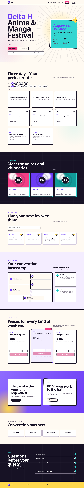

# Delta H Convention Platform

Delta H combines a public anime/manga convention website with the existing private volunteer and staff operations portal. The public surface includes programming, guests, vendors, an attendee map, tickets, sponsors, and FAQs. The authenticated Discord-linked portal continues to handle schedules, check-in, hotel coordination, Guest Relations, Safety incidents, alerts, and coordinator notes.

Ticket checkout uses Stripe-hosted Checkout. Delta H owns the catalog and pricing, records pending orders, verifies raw signed webhooks, and issues ticket codes only after Stripe confirms payment. No card fields or card data pass through this application.

## Browser evidence

Desktop (1440px, full page):



Mobile (390px, full page):


Both captures use the clearly labeled sample configuration in `api/config.example.php`. Playwright verified zero horizontal overflow and zero browser console errors at both widths.

## Security model

- Discord OAuth is the only interactive login path.
- Guild roles gate coordinator, Guest Relations, and Safety surfaces.
- Mutating API actions require POST plus a per-session CSRF token. Public checkout creation uses the CSRF token returned by `public_event`.
- The Stripe webhook is the sole CSRF-exempt payment action and is accepted only after `Stripe-Signature` verification over the raw payload.
- Ticket names, amounts, currency, metadata, and return URLs are server-owned. Browser-supplied values cannot override them.
- Checkout creation and webhook fulfillment are idempotent; client redirects never mark an order paid.
- Session cookies are HTTP-only, SameSite=Lax, and Secure on HTTPS.
- Uploaded incident evidence is MIME-checked, randomly named, stored under a non-executable directory, and downloaded as an attachment.
- Database schema changes run only through the CLI migration command.
- `api/config.php` and uploaded evidence are runtime-only and must never be committed.

## Verify locally

```bash
python3 -m unittest discover -s tests -v
node --check core.js
podman run --rm -v "$PWD:/app:ro,Z" -w /app php:8.2-cli-alpine \
  sh -lc 'find . -type f -name "*.php" -print0 | sort -z | xargs -0 -n1 php -l && php tests/stripe_unit.php'
python3 scripts/build-release.py
```

The release builder writes:

- `dist/delta-h-release.zip`
- `dist/release-manifest.json`

The ZIP contains only allowlisted runtime files plus the P0 architecture/operations note at `EVENTENY_INSPIRED_OVERHAUL.md`. It deliberately excludes live configuration, uploaded evidence, tests, migrations, and maintenance/debug endpoints.

## Configure a deployment

1. Copy `api/config.example.php` to `api/config.php` on the server.
2. Fill the server copy with database and Discord credentials.
   - Set `discord_vendor_hall_role_id` to the Discord role allowed to manage Vendor Hall positions.
   - Leaving `discord_vendor_hall_role_id` blank denies Vendor Hall access to non-admin accounts.
3. Replace every sample value under `public_event`, especially the event identity, dates, venue, canonical URL, policies, program data, and directory entries. Replace the `stripe_ticket_catalog` SKUs, names, descriptions, and integer cent amounts with the approved catalog.
4. Keep `api/config.php` out of Git and deployment archives.
5. Run `php scripts/migrate.php EXPECTED_DATABASE` once for that environment. The explicit database name is a fail-closed guard against running a migration on the wrong database.
6. Deploy to an isolated staging hostname before production.

See [`docs/DEPLOY-PLESK.md`](docs/DEPLOY-PLESK.md) for the staging and Plesk Git procedure.

## Stripe test-mode setup

This code intentionally accepts `sk_test_…` secret keys only. Blank keys leave the public site usable while every ticket card clearly reports that sales are not configured.

1. In a Stripe test-mode account, copy the test secret key into the deployment-only `api/config.php` as `stripe_secret_key`.
2. Confirm `stripe_currency`, `stripe_ticket_catalog`, and `public_event.canonical_url`. The canonical URL owns both Checkout return URLs:
   - `index.html?checkout=success&session_id={CHECKOUT_SESSION_ID}`
   - `index.html?checkout=cancel`
3. Create a Stripe webhook endpoint for:

   ```text
   https://YOUR-CONVENTION-HOST/api/api.php?action=stripe_webhook
   ```

4. Subscribe it to:
   - `checkout.session.completed`
   - `checkout.session.async_payment_succeeded`
   - `checkout.session.async_payment_failed`
5. Copy that endpoint’s `whsec_…` signing secret into `stripe_webhook_secret`.
6. Complete a Stripe test Checkout, deliver its webhook, and confirm the return page changes from pending to paid and displays one issued code per purchased ticket.

The success URL is only a status viewer. It cannot fulfill an order, and codes remain hidden until a verified webhook commits fulfillment. Purchaser email is retained only on the private order record and is never included in `public_event` or `checkout_status`.

### Live-payment boundary

Live payments are **not enabled** merely by deploying this code. The P0 implementation rejects `sk_live_…` keys, the example keys are blank, sample event content is labeled, and no real-money transaction has been authorized or tested here. Moving to live mode requires a separate security, policy, catalog, tax, refund, email-delivery, operational-readiness, and Stripe-account review.

## Important credential notice

The July 19 source ZIP supplied for recovery contained live credentials in multiple files. Those values are not present in this repository or its release archive. Rotate the database password, Discord client secret, Discord bot token, and cron secret before the hardened release is promoted to production.
