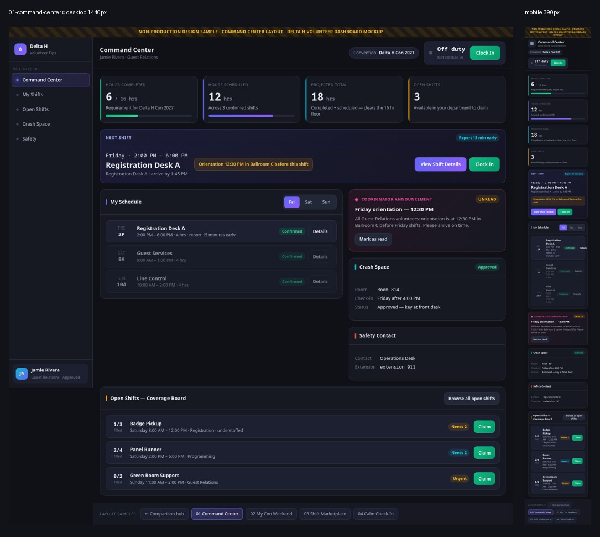
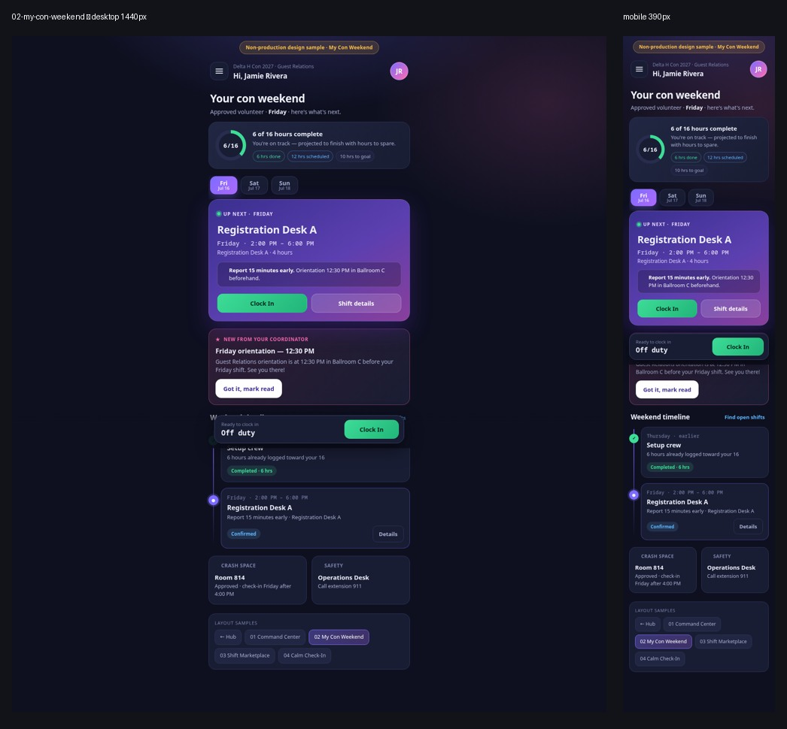
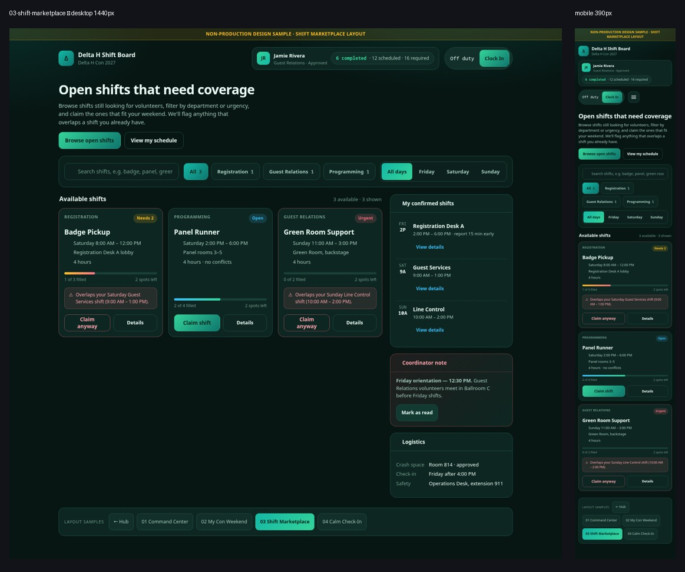
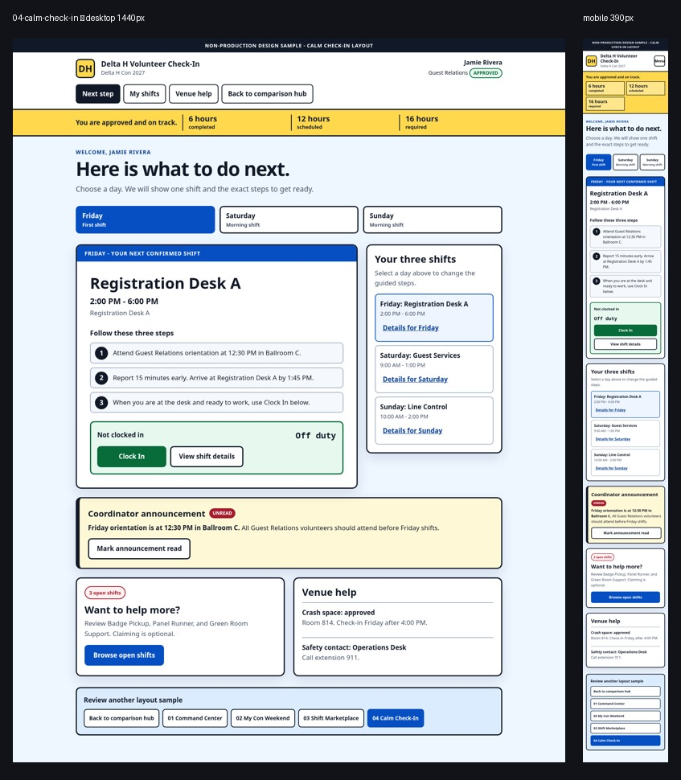

# Delta H volunteer dashboard layout sketches

These four clickable concepts are non-production design samples for reviewing a future volunteer-facing dashboard. They use the same Jamie Rivera / Delta H Con 2027 scenario so reviewers can compare information architecture and interaction patterns instead of comparing different content.

The sketches do not change or connect to the production dashboard. They do not call an API, persist changes, authenticate users, or modify the repository's production `index.html`, `core.js`, or `styles.css`. Clock, claim, read, filter, day, menu, and detail states reset when a page is reloaded.

## Concept matrix

| Concept | Primary focus | Best for | Strengths | Tradeoffs | Device sweet spot |
| --- | --- | --- | --- | --- | --- |
| 01 Command Center | Operational status and coverage metrics | Experienced volunteers and coordinators | Highest information density; persistent navigation; at-a-glance hours, logistics, and coverage | More to scan; heavier for first-time volunteers | Desktop |
| 02 My Con Weekend | A personal, chronological itinerary | Most volunteers | Answers "where do I go next?"; friendly mobile flow; schedule and actions stay close together | Less dense for power users and coordinators | Phone |
| 03 Shift Marketplace | Discovering and claiming staffing gaps | Volunteers who want to self-schedule and coverage-focused teams | Search and filters; visible urgency and coverage; conflict warnings before a risky claim | Personal status is secondary; more transactional | Phone or desktop |
| 04 Calm Check-In | Guided, low-stress next steps | First-time volunteers and people working in noisy venue conditions | Largest controls; high contrast; explicit instructions; low cognitive load | Lower information density; more vertical scrolling | Phone at the venue |

## Recommendation

Use **02 My Con Weekend** as the default direction for ordinary volunteers. Most people open a convention dashboard briefly on a phone to answer one question: "Where do I go next?" The recommended layout answers that in the first screen, makes clocking in and viewing details easy, and still keeps the full weekend, announcements, logistics, and open shifts within reach.

Command Center can inform a coordinator or power-user view. Shift Marketplace is valuable when filling staffing gaps is the primary product goal. Calm Check-In is a strong accessibility-first mode or onboarding direction.

## Preview gallery

Each contact sheet shows the desktop layout at 1440 px beside its 390 px mobile treatment.

### 01 — Command Center



### 02 — My Con Weekend



### 03 — Shift Marketplace



### 04 — Calm Check-In



## Review the sketches

No build step or external dependency is required.

1. From the repository root, run:

   ```sh
   python3 -m http.server 8000
   ```

2. Open `http://localhost:8000/sketches/volunteer-dashboard/`.
3. Review each concept at approximately 390 px and 1440 px viewport widths.
4. In every concept, try:
   - Friday, Saturday, and Sunday controls
   - Clock In, the elapsed timer, and Clock Out
   - View shift details
   - Browse open shifts and claim one
   - Mark the coordinator announcement read
   - The responsive menu at a narrow width
   - The layout switcher and comparison-hub link
5. In Shift Marketplace, also test search, department/day filters, a no-conflict claim, and a conflict-warning claim.

The hub and all variants also work when their `index.html` files are opened directly with `file://`. Relative links intentionally resolve in both review modes.

## Shared review scenario

- Jamie Rivera, Guest Relations, approved for Delta H Con 2027
- 16 required hours, 6 completed hours, and 12 scheduled hours
- Friday Registration Desk A, Saturday Guest Services, and Sunday Line Control shifts
- Badge Pickup, Panel Runner, and Green Room Support open shifts
- One unread Friday orientation announcement
- Approved crash space in Room 814 and the Operations Desk safety contact

All names, schedules, room assignments, status changes, and timers in these pages are sample data only.
